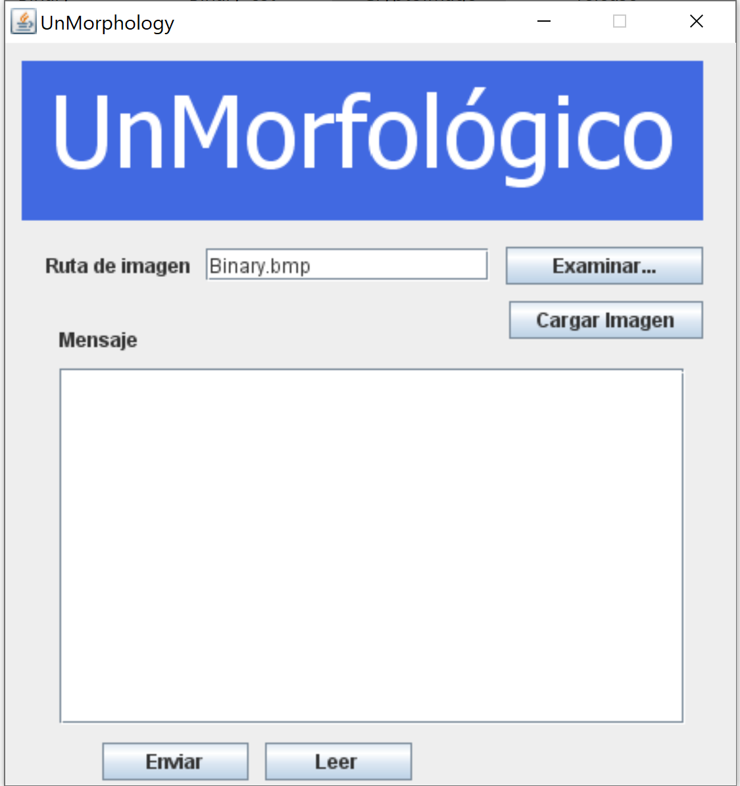
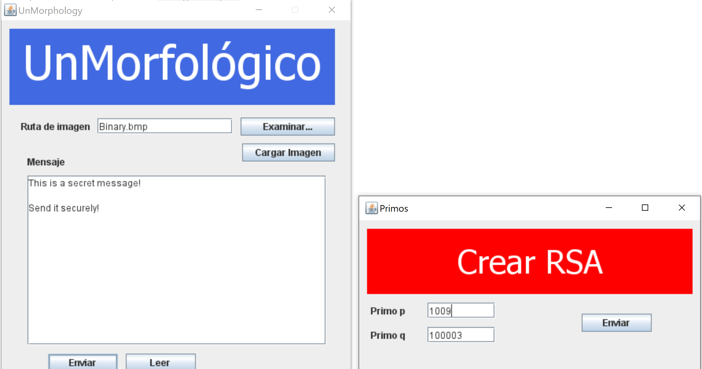
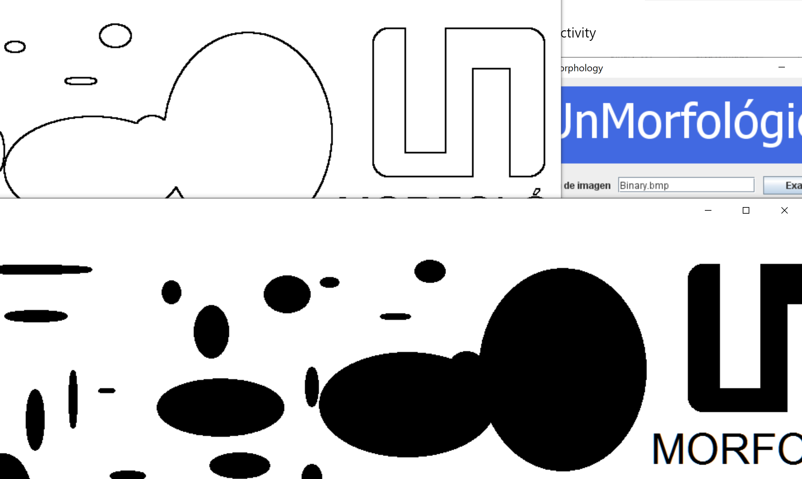
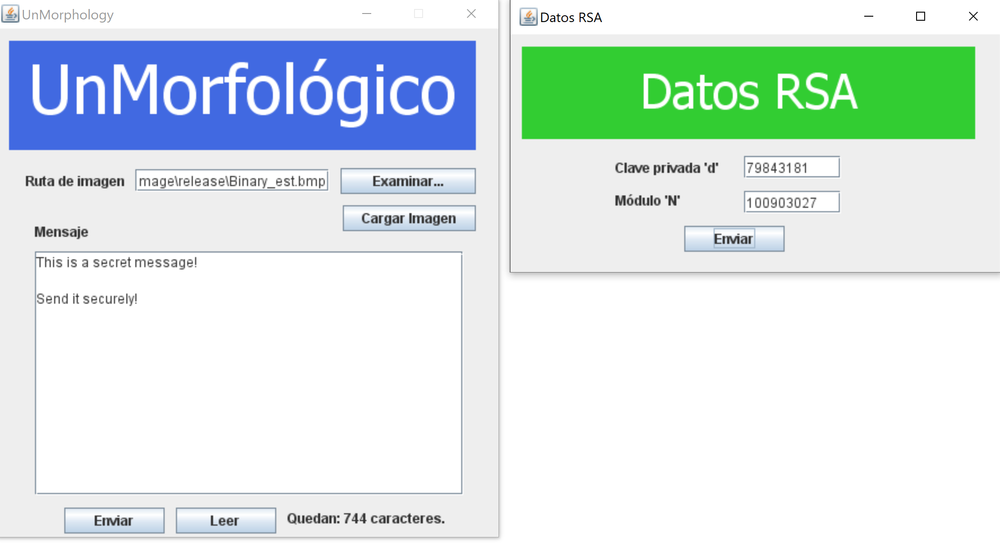

# CryptoImage

CryptoImage is a Java application for sending secure messages.

You have a message you need to send? Just type your message in the application and select an black/withe image where the encrypted message is going to be hidden. Then send that image to a the receiver who only needs to open the image with the application and a password to access and will get the message as you wrote it!

#### Download

You can download the latest version on out releases [page](https://github.com/amrondonp/CryptoImage/releases)

#### Screenshots

Main activity

Writing a secret message

Resulting images with secret message

Reading secret message from the image

